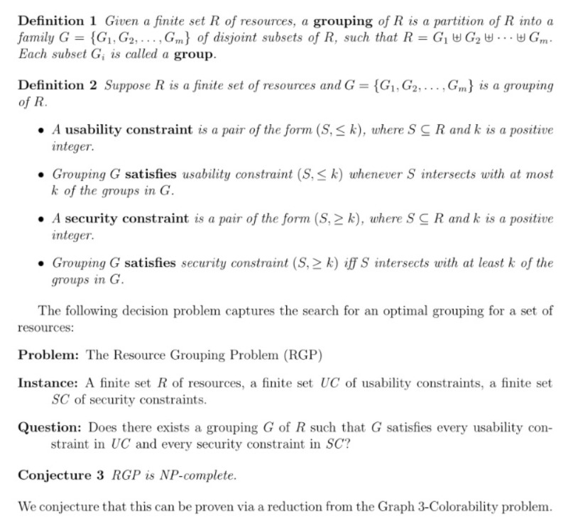
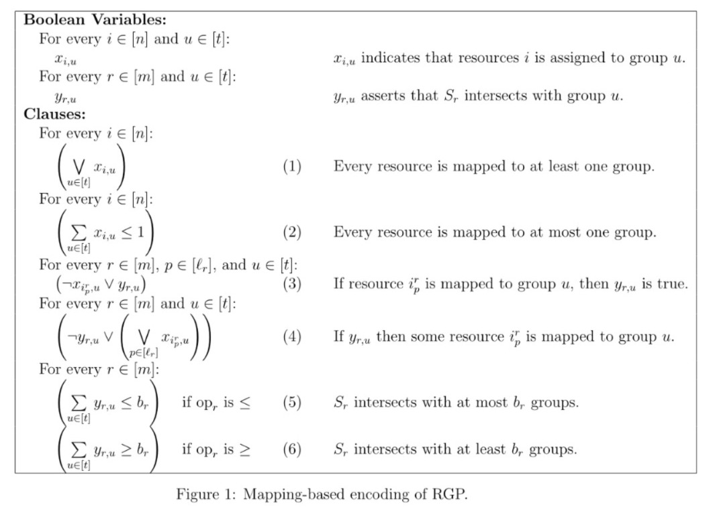
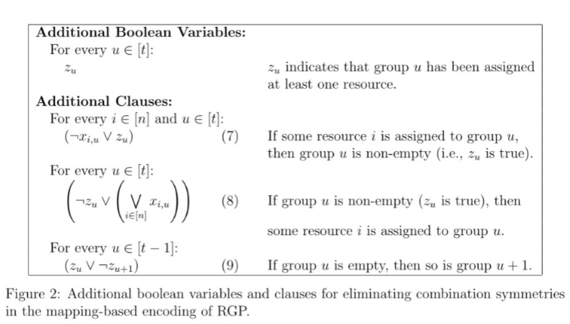
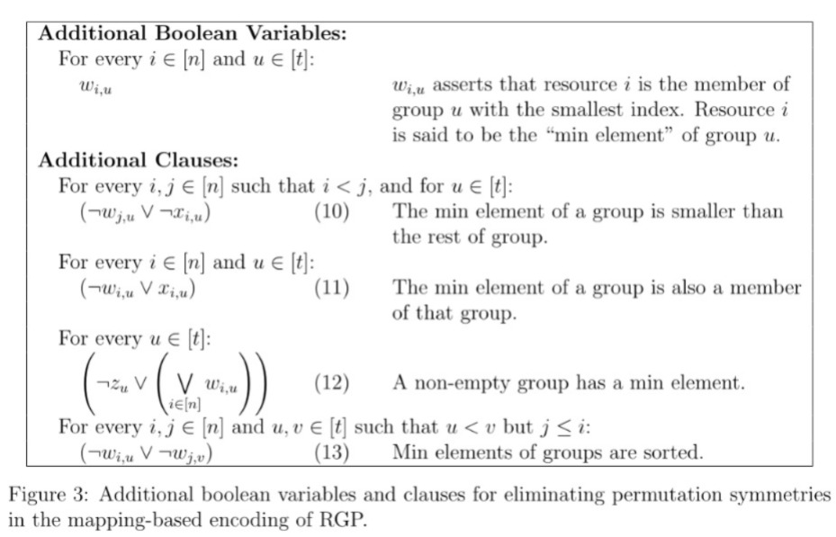
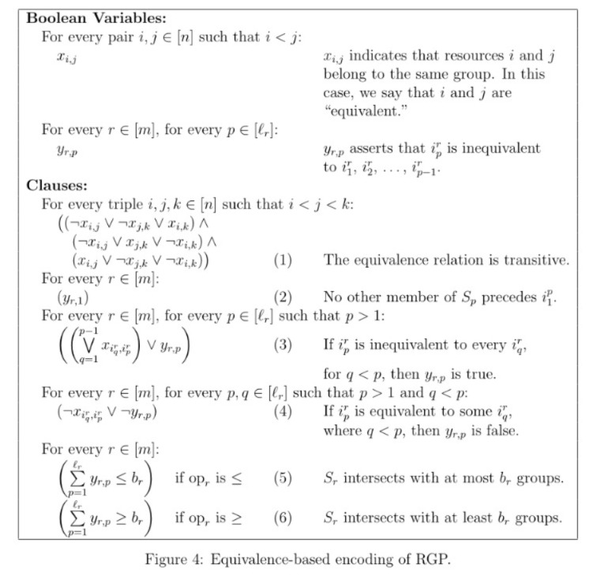

# ZeeTee - A Tool For Balancing Usability & Security in a Zero Trust Environment

## Project Workflow


## The Resource Grouping Problem (RGP)



## Mapping-Based Encoding



### Eliminating Combination Symmetries



### Eliminating Permutation Symmetries



## Equivalence-Based Encoding



Given an RGP instance, our tool ($ZeeTee$) determines whether there exists a grouping that satisfies all usability and security constraints. We first generate RGP instances using the experiment configuration specified by the user. We then use two encodings (Mapping-Based & Equivalence-Based) to convert the RGP instances to valid SAT instances. These SAT instances are then solved using SAT solvers. If the SAT instance is satisfiable, a valid grouping of the resources, satisfying all constraints, does exist and if the SAT instance is unsatisfiable, then a valid grouping satisfying all constraints does not exist. In this way, we can solve the Resource Grouping Problem (RGP).

## 📌 Prerequisites

### 💻 System requirement :

1. Any system with basic configuration.
2. Operating System : Any (Windows / Linux / Mac).
3. Access to an High Performance Computing (HPC) Setup (Preferable for running experiments)

### 💿 Software requirement :

1. Python installed (If not download it [here](https://www.python.org/downloads/)).
2. Poetry Installed (If not download it [here](https://python-poetry.org/docs/)).
2. Any text editor of your choice.

## 🔧 Installation & Setup

### 🏗️ Clone The Repository :

```
$ git clone https://github.com/NVombat/zeetee.git
```

### ➕ Install Dependencies :

```
$ poetry install

OR

$ pip install -r requirements.txt
```

If you do not wish to use poetry, you can convert the poetry.lock file to a requirements.txt file and then install the necessary dependencies.

### 📝 Setup .env File :

Refer to .env.example and create project secrets. Setup Email API keys and Target Email ID

### 🔐 Setup Configuration Files :

Given below is a sample configuration file. While naming configuration files they should be named as such:

```
$ FILENAME -> experiment_config_N10.json
$ FILENAME -> experiment_config_N700.json
```

The number following N is the value of N (num_resources) in the experiment configuration file.
All the configuration files used can be found in the ```/data/configfiles``` directory

You can refer to our Configuration Files when setting up your own.


Configuration files are .json files with the following keys:

```
$ 'num_instances' [int] - Number of RGP instances to be generated
$ 'num_resources' [list] - Number of RGP resources to be generated
$ 'constraint_percentages' [list] - Number of constraints expressed as a ratio to num_resources
$ 'constraint_size' [list] - Size of the set S in a constraint (S, op b)
$ 'timeout' [int] - Timeout limit for the solver (in milliseconds)
```

The information stored in a configuration file is eventually used by ```\src\generator.py``` to generate RGP instances.

### 🔐 Setup SLURM Files [For HPC] :

SLURM Documentation can be found [here](https://slurm.schedmd.com/documentation.html).

If an HPC setup is being used, then a SLURM file will have to be setup.
All the SLURM files used can be found in the ```/data/slurm directory```.

We have used 4 different types of slurm files based on what they do:

```
$ TYPE 1 -> run_existing_N10.slurm
$ TYPE 2 -> run_experiment_N10.slurm
$ TYPE 3 -> pre_process_N10.slurm
$ TYPE 4 -> solve_preprocessed_N10.slurm
```

You can refer to our SLURM Files when setting up your own.

### 🚀 Run Project :

The main entry point is the run.sh file. We first convert this file to an executable.

```
$ chmod u+x run.sh
```

arc_runner.py and runner.py can be used to further fine tune parameters for running the project.

The project can be run in 4 different ways:

```
$ ./run.sh arc_runner N10 0
```
Run Exisiting (```TYPE 1```): In this case the user must provide the path to a file containing RGP instances that have already been generated. That file will be used to then generate SAT instances which will be solved by a SAT solver.

```
$ ./run.sh arc_runner N10 1
```
Preprocess & Solve (```TYPE 2```): In this case the user must provide the path to a file containing the experiment configuration. This file is used to generate RGP instances which will then be used to generate SAT instances. These instances will then be solved by a SAT solver.

```
$ ./run.sh arc_runner N10 2
```
Preprocess (```TYPE 3```): In this case the user must provide the path to a file containing the experiment configuration and set the 'preprocess' flag to TRUE. This will enable the RGP instances to be converted to SAT instances which will be stored in json files. They will need to be solved separately.

```
$ ./run.sh arc_runner N10 3
```
Solve Preprocessed (```TYPE 4```): In this case the user will need to provide the paths to the preprocessed RGP instances (Stored SAT instances) and set the 'solve_preprocessed' flag to TRUE. This will enable the SAT instances to be solved directly from the JSON files where they were being stored.

In addition to this, the user is given a choice to:

```
$ Run the code in a serial or parallel manner
$ Plot the results in the form of a Cactus Plot
$ Mail the results to the user
$ Use a custom SAT Solver
```

### 🗑️ Clean Up :

Log and result files are generated as a result of running the project or an experiment. A cleanup script (```cleanup.sh```) is present to remove all these files. First convert the script to an executable format and then run the script to cleanup all the files that are generated.

```
$ chmod u+x cleanup.sh
$ ./cleanup.sh
```

## 📄 Publication Details

[Nikhill Vombatkere; Philip W.L. Fong – “Zero Trust Continuous Authentication Models and Automated Policy Formulation” – Accepted on 29 Jul 2025 to the The Information Security Conference (ISC) 2025](INSERT_DOI_HERE)
